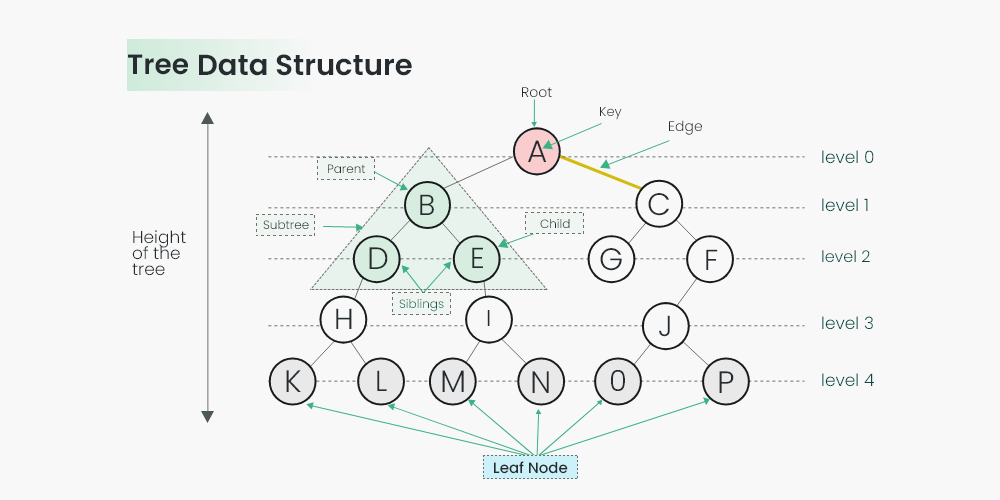

# Contributing to Free Association

## Introduction

Welcome! This document serves as your guide to understanding and contributing to the Free Association project - a technical implementation of a revolutionary social-economic model based on mutual recognition and contribution.

### Why Contribute?

The Free Association project is not just another web application - it's a proof-of-concept for a fundamentally new way to organize human collaboration. By contributing, you are:

1. **Building Alternative Economic Systems** - Helping create tools that demonstrate how truly free social coordination can work without centralized control or markets

2. **Working on Cutting-Edge Visualization** - Creating intuitive interfaces for social-economic concepts through interactive tree structures and data visualization

3. **Implementing Recursive Mathematics** - Bringing to life mathematical concepts of mutual recognition, contribution networks, and proportional distribution

4. **Joining a Mission-Driven Project** - Contributing to a project that aims to create a world where the free development of each is the condition for the free development of all

### Getting Started

To run the project locally:

```bash
# Install dependencies
bun install

# Start the development server
bun run dev
```

This will start the application and make it available at http://localhost:3000 (or another port if specified).

### How This Document Helps

This guide breaks down the core components of the application's architecture in progressive detail:

- **High-level overview** - Understand the tree data structure that forms the foundation
- **Data flow explanations** - Learn how information moves between components
- **Visualization details** - Dive into the D3-based visualizations that make concepts tangible

Whether you're a developer interested in the technical challenges or someone passionate about alternative economic systems, understanding this document will equip you to make meaningful contributions to the project.

Let's build tools for a more collaborative future together!

## Table of Contents
- [Overview](#contributing-to-free-association)
- [Project Structure and Tree-Based Calculations](#project-structure-and-tree-based-calculations)
  - [Tree Data Structure Overview](#tree-data-structure-overview)
  - [Core Components](#core-components)
    - [TreeNode Class](#treenode-class)
    - [App Class](#app-class)
    - [Gun DB Integration](#gun-db-integration)
  - [Key Tree Calculations](#key-tree-calculatsions)
    - [Fulfillment Calculation](#fulfillment-calculation-recursive)
    - [Weight Calculation](#weight-calculation)
    - [Share of Parent](#share-of-parent)
    - [Mutual Recognition Calculations](#mutual-recognition-calculations)
  - [Visualization Components](#visualization-components)
  - [Data Flow](#data-flow)
  - [Recursive Proportion Distribution](#recursive-proportion-distribution)
  - [Contributing to the Codebase](#contributing-to-the-codebase)
- [Data Flow Between App and TreeMap](#data-flow-between-app-and-treemap)
  - [Initialization Flow](#initialization-flow)
  - [Update Cycle](#update-cycle)
  - [Bidirectional Communication](#bidirectional-communVication)
  - [Gun DB Subscriptions](#gun-db-subscriptions)
- [Understanding the TreeMap Visualization](#understanding-the-treemap-visualization)
  - [TreeMap Algorithm Basics](#treemap-algorithm-basics)
  - [TreeMap Creation Process](#treemap-creation-process)
  - [Custom Tiling Algorithm](#custom-tiling-algorithm)
  - [Interactive Features](#interactive-features)
  - [Rendering Process](#rendering-process)
  - [Zoom Transitions](#zoom-transitions)
  - [Responsive Design](#responsive-design)
  - [Font Sizing Logic](#font-sizing-logic)
  - [State Management](#state-management)
  - [Debugging Tips](#debugging-tips)

# Project Structure and Tree-Based Calculations



## Tree Data Structure Overview

Free Association uses a tree-based data structure to represent nodes of contribution and their relationships. The system is built on a peer-to-peer database (Gun DB) that enables real-time collaboration and data synchronization across users.

## Core Components

### TreeNode Class

The `TreeNode` class (in `src/models/TreeNode.ts`) is the fundamental building block of our tree structure:

```
TreeNode
├── id: string
├── _name: string
├── _points: number
├── gunRef: any
├── _parent: TreeNode | null
├── children: Map<string, TreeNode>
├── _manualFulfillment: number | null
├── _typesMap: Map<string, TreeNode>
├── typeIndex: Map<TreeNode, Set<TreeNode>>
├── app: App
└── gunSubscriptions
```

Each TreeNode:
- Has a unique ID (used in Gun DB)
- Has one parent (except the root node)
- Can have multiple children (stored in a Map)
- Can be associated with multiple types (stored in a Map)
- Has points representing its contribution weight
- Maintains persistent connections to the distributed database

### App Class

The `App` class (in `src/App.ts`) serves as the application controller:

```
App
├── name: string
├── rootId: string
├── rootNode: TreeNode | null
├── treemap: ReturnType<typeof createTreemap>
├── updateFlags and intervals
├── userCardsGrid
└── peerTrees: Map<string, TreeNode>
```

The App class:
- Initializes the root node and UI
- Manages visualizations (TreeMap and PieChart)
- Handles updates and synchronization
- Manages connections to peer trees

### Gun DB Integration

The application uses Gun DB, a decentralized graph database:

- Each TreeNode has a corresponding entry in Gun DB
- Changes are automatically synchronized across peers
- Subscriptions ensure real-time updates
- Data persists across sessions

## Key Tree Calculations

### Fulfillment Calculation (Recursive)

The `fulfilled` getter is calculated recursively through the tree:

1. **For leaf nodes**:
   - If a leaf is a contribution: fulfillment = 1.0
   - If a leaf is not a contribution: fulfillment = 0

2. **For branch nodes**:
   - Either uses manual fulfillment (if set and has contributor children)
   - Or calculates as the weighted sum of children's fulfillment:
     ```javascript
     fulfilled = Array.from(this.children.values()).reduce(
       (sum, child) => sum + child.fulfilled * child.shareOfParent,
       0
     );
     ```

3. **Hybrid cases** (nodes with both contributor and non-contributor children):
   - Combines manual fulfillment for contributor children with calculated fulfillment for non-contributor children

### Weight Calculation

The `weight` property represents a node's proportional importance in the entire tree:

```javascript
get weight(): number {
  if (!this.parent) return 1;
  return this.parent.totalChildPoints === 0
    ? 0
    : (this._points / this._parent.totalChildPoints) * this._parent.weight;
}
```

### Share of Parent

The `shareOfParent` property represents what fraction of the parent's total points a node contributes:

```javascript
get shareOfParent(): number {
  if (!this.parent) return 1;
  return this.parent.totalChildPoints === 0
    ? 0
    : this._points / this._parent.totalChildPoints;
}
```

### Mutual Recognition Calculations

The system computes "mutual recognition" between nodes:

1. `shareOfGeneralFulfillment(node)` - What portion of recognition one node gives to another
2. `mutualFulfillment(node)` - The minimum of bidirectional recognition between nodes
3. `mutualFulfillmentDistribution` - A distribution map of mutual recognition across all types

## Visualization Components

The tree structure is visualized through:

1. **TreeMap** (`src/visualizations/TreeMap.ts`):
   - Renders the hierarchical structure as nested rectangles
   - Enables navigation, growth/shrinking of nodes
   - Interactive visualization of the tree structure

2. **PieChart** (`src/visualizations/PieChart.ts`):
   - Displays mutual fulfillment distribution
   - Shows relationships between different types

3. **UserCards** (`src/components/UserCards.ts`):
   - Displays available users and types
   - Enables drag-and-drop for adding types to nodes

## Data Flow

1. The App initializes with a root TreeNode
2. Changes to nodes are persisted to Gun DB
3. Gun DB subscriptions ensure all peers receive updates
4. UI components subscribe to changes and update accordingly
5. Visualizations reflect the current state of the tree

## Recursive Proportion Distribution

The propagation of fulfillment through the tree:

1. Children contribute to parent fulfillment proportionally to their share
2. Fulfillment flows upward from leaves to root
3. Recognition flows bidirectionally across the network

## Contributing to the Codebase

When working with this architecture:

1. Changes to node properties automatically persist to Gun DB
2. The `updateNeeded` and `pieUpdateNeeded` flags in App trigger visualization updates
3. Subscriptions maintain real-time synchronization across components

## Data Flow Between App and TreeMap

Understanding the data flow between components is crucial:

### Initialization Flow

1. **App Creation and Initialization**:
   ```javascript
   async initialize() {
     // Load or create root node
     this.rootNode = await TreeNode.fromId(this.rootId) || new TreeNode(this.name, this.rootId);
     
     // Create visualization
     this.treemap = createTreemap(this.rootNode, width, height);
     container.appendChild(this.treemap.element);
     
     // Set up update interval
     this.updateInterval = setInterval(() => {
       if (this._updateNeeded) {
         this.updateTreeMap();
         this._updateNeeded = false;
       }
       // ...other updates
     }, 1000);
   }
   ```

2. **TreeMap Creation**:
   ```javascript
   export function createTreemap(data: TreeNode, width: number, height: number): TreemapInstance {
     // Convert TreeNode to D3 hierarchy
     let hierarchy = d3.hierarchy(data, d => d.childrenArray)
         .sum(d => d.data.points);
     
     // Apply treemap layout and create visualization
     // ...
   }
   ```

### Update Cycle

1. **State Changes**:
   - Modifications to TreeNodes set `app.updateNeeded = true`
   - Gun DB subscriptions update node properties when changes occur

2. **Visualization Refresh**:
   ```javascript
   updateTreeMap() {
     if (container && this.treemap && this.rootNode) {
       this.treemap.destroy();
       container.innerHTML = '';
       this.treemap = createTreemap(this.rootNode, container.clientWidth, container.clientHeight);
       container.appendChild(this.treemap.element);
     }
   }
   ```

### Bidirectional Communication

1. **TreeMap to App**:
   - User interactions in TreeMap update the current view
   - The App accesses this via `this.currentView` getter

2. **App to TreeMap**:
   - Tree structure modifications flow to the TreeMap on refresh
   - TreeNode implements D3-compatible methods like `childrenArray`, `value`, etc.

### Gun DB Subscriptions

The TreeNode class maintains subscriptions to Gun DB:

```javascript
setupSubscriptions() {
  // Subscribe to node data changes
  this.nodeSubscription = readFromGunPath(['nodes', this.id], true);
  this.nodeSubscription.gunNodeRef.on((data) => {
    if (data) {
      // Update local properties when data changes in Gun DB
      if (data.name !== undefined) this._name = data.name;
      if (typeof data.points === 'number') this._points = data.points;
      // ...other properties
    }
  });
  
  // Subscribe to children and types changes
  // ...
}
```

This ensures all changes are synchronized across the application.

## Understanding the TreeMap Visualization

The TreeMap visualization renders the tree structure as nested rectangles:

### TreeMap Algorithm Basics

1. **Hierarchical Representation**:
   - Rectangles sized proportionally to node values
   - Parent nodes contain nested children rectangles
   - Area corresponds to the node's points

2. **D3.js Implementation**:
   - Custom tile function maintains exact proportions
   - Layout converts hierarchical data into rectangles with coordinates

### TreeMap Creation Process

The visualization goes through several steps:

1. Create scales for mapping data to screen coordinates
2. Convert TreeNode structure to D3 hierarchy
3. Apply treemap layout with custom tile function
4. Create SVG element and render rectangles
5. Add interactive features (zooming, growth/shrinking)

### Custom Tiling Algorithm

The TreeMap uses a custom tiling algorithm that directly uses node point values rather than calculating them from descendants:

```javascript
function tile(node, x0, y0, x1, y1) {
    if (!node.children) return;
    
    // Use points directly from data
    node.children.forEach(child => {
        child.value = child.data.points;
    });
    
    // Apply squarify algorithm with available space
    const tempHierarchy = d3.hierarchy(/* simplified structure */)
    d3.treemapSquarify(tempHierarchy, 0, 0, availableWidth, availableHeight);
    
    // Transfer positions back to our nodes
    node.children.forEach((child, i) => {
        child.x0 = x0 + tempNode.x0;
        child.x1 = x0 + tempNode.x1;
        // etc.
    });
}
```

This approach ensures the treemap reflects the exact point values from our Node model.

### Interactive Features

The TreeMap includes:

1. **Zooming Navigation**:
   - Click to zoom in/out of nodes
   - Home button to return to original view

2. **Node Growth/Shrinking**:
   - Long press to increase points
   - Right-click/two-finger touch to decrease points

3. **Type Navigation**:
   - Type indicators as colored circles
   - Click to filter by type

### Rendering Process

The rendering includes:

1. Creating group elements for each node
2. Adding rectangles sized according to node values
3. Adding text labels with dynamic sizing
4. Attaching event handlers for interaction

### Zoom Transitions

Smooth transitions between views:

```javascript
function zoomin(d) {
  // Update domains to node boundaries
  x.domain([d.x0, d.x1]);
  y.domain([d.y0, d.y1]);
  
  // Create new view and animate transition
  // ...
}
```

### Responsive Design

The TreeMap adjusts to container size changes:

```javascript
update: (newWidth, newHeight) => {
  // Update scales and SVG viewBox
  x.rangeRound([0, newWidth]);
  y.rangeRound([0, newHeight]);
  svg.attr("viewBox", [0.5, -50.5, newWidth, newHeight + 50]);
  
  // Re-render current view
  // ...
}
```

### Font Sizing Logic

Text sizes adapt to available space using the `calculateFontSize` utility function.

### State Management

The TreeMap maintains:
- `currentView` - Currently displayed node
- `root` - Root of the hierarchy
- Growth-related states for interactive resizing

### Debugging Tips

1. Use browser dev tools to inspect the SVG structure (ctrl+shift+i)
2. Check TreeNode console.logs prefixed with `[TreeNode]`
3. Review App logs prefixed with `[App]` for initialization and update issues
